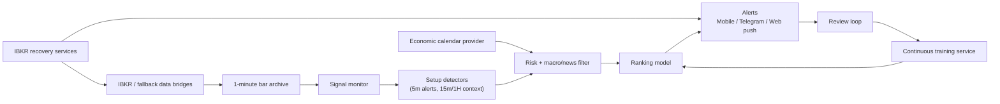

# Trading Algorithm

Futures signal-operations platform for `NQ` and `ES` that combines rule-based setup detection, macro/news filtering, continuous ranking-model retraining, broker-session recovery, and operator-facing mobile alerts.

This is a portfolio project built to solve a practical problem: keep a discretionary futures workflow disciplined, observable, and repeatable without turning it into a black-box auto trader.

## What This Project Does

- detects multiple intraday futures setups from live `NQ` / `ES` market data
- ranks setups with a continuously retrained model instead of static priority weights
- blocks or penalizes setups around macro events and risk-policy violations
- delivers alerts to mobile/web/Telegram with review and acknowledgment workflows
- survives broker disconnects with IBKR recovery logic, fallback notifications, and state persistence
- keeps an auditable event trail for signals, reviews, training, and recovery operations

## Why It Is Interesting

This is not a toy charting script. It combines several systems that usually live separately:

- live market-data ingestion
- multi-timeframe setup detection
- model training and promotion
- economic-calendar context
- mobile UI and push delivery
- broker-session recovery on a VPS

The interesting engineering work is in the glue: keeping those systems stateful, testable, and understandable under real operational constraints.

## Architecture

A deeper version is in [docs/ARCHITECTURE.md](./docs/ARCHITECTURE.md).



## Core Engineering Highlights

### 1. Multi-setup futures engine
The signal engine does not depend on a single pattern. It can evaluate multiple setups in parallel, including a Werlein-style liquidity / SMT / higher-timeframe context setup added as a separate detector rather than hard-replacing the base engine.

### 2. 5-minute alerting with higher-timeframe context
Alerts are generated on closed `5m` bars, while the setup logic can still use `15m` and `1H` structure for context. That keeps entries timely without throwing away higher-timeframe signal quality.

### 3. Continuous model retraining
The ranking model retrains automatically on the VPS from historical bars, live bars, and review outcomes. The active live model is updated continuously so the system adapts instead of freezing a one-time score map.

### 4. Macro-aware filtering
The signal engine integrates a live economic calendar layer and scores/blocks setups around relevant macro events instead of pretending price action exists in isolation.

### 5. Broker recovery as an application feature
IBKR disconnects are treated as a first-class operational problem. The system persists reconnect state, sends recovery-progress notifications, and supports phone-assisted recovery rather than leaving broker outages invisible.

### 6. Operator-facing mobile workflow
The mobile UI is not a generic dashboard. It is designed around the actual operational loop: signal review, setup filtering, recovery status, session summary, and training visibility.

## Stack

- **Backend:** TypeScript, Fastify, Node.js
- **Validation:** Zod
- **Training:** custom ranking-model pipeline over historical + live examples
- **Market data:** IBKR TWS API / IB Gateway, with fallback bridge support
- **Calendar/news context:** Forex Factory provider integration with pluggable calendar client interface
- **Notifications:** Telegram, web push, native push hooks
- **Mobile UI:** hosted PWA + Capacitor iOS wrapper
- **Desktop:** Electron shell / Mac notifier utilities
- **Testing:** Vitest unit, integration, and acceptance coverage
- **Deployment:** GitHub Actions -> VPS workflow

## Repository Layout

- [Trading_Algorithm_v1/](./Trading_Algorithm_v1): active application codebase
- [Trading_Algorithm_v1/src](./Trading_Algorithm_v1/src): API, signal engine, training, integrations
- [Trading_Algorithm_v1/mobile](./Trading_Algorithm_v1/mobile): mobile PWA source
- [Trading_Algorithm_v1/desktop](./Trading_Algorithm_v1/desktop): desktop notifier and shell
- [Trading_Algorithm_v1/scripts](./Trading_Algorithm_v1/scripts): VPS deployment, IBKR, and ops scripts
- [Trading_Algorithm_v1/tests](./Trading_Algorithm_v1/tests): unit, integration, and acceptance tests
- [docs/ARCHITECTURE.md](./docs/ARCHITECTURE.md): system overview and design tradeoffs

## Fast Evaluation

From the active app directory:

```bash
cd Trading_Algorithm_v1
npm install
npm run build
npm test
npm run dev
```

Key employer-facing signals in the repo:

- meaningful test coverage instead of hand-wavy claims
- explicit risk controls and manual-execution boundaries
- real deployment workflow and VPS operating model
- evidence of iterative operational engineering, not just feature accumulation

## Product Boundaries

The system is intentionally **manual-execution first**.

It helps detect, rank, filter, and review setups. It does not pretend that automated order placement is the only interesting problem in trading software. That constraint is deliberate and reflected in the code.

## Current State

- active futures symbols: `NQ`, `ES`
- alert timeframe: `5m`
- higher-timeframe context: `15m`, `1H`, `4H`, `D1`, `W1`
- live broker/data path: IBKR on VPS
- live economic calendar path: Forex Factory integration
- continuous training: enabled on VPS

## Notes For Reviewers

- The active app lives in `Trading_Algorithm_v1/` because this repository evolved through several iterations rather than being curated from day one.
- The root README is the portfolio overview; the nested README is the runtime/operator documentation.
- No secrets are stored in the repository; only example env files are tracked.

## Runtime Documentation

For the full operator/deployment README, see:

- [Trading_Algorithm_v1/README.md](./Trading_Algorithm_v1/README.md)
